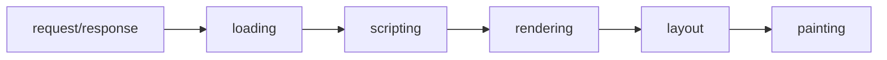
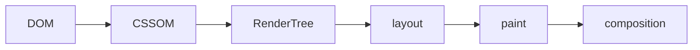

브라우저가 HTML파일을 요청하고, 서버로부터 HTML을 받습니다.

그 이후, HTML파서가 HTML 파일을 한 줄 씩 읽어나가며 DOM Tree를 구성합니다. 

브라우저에서 DOM Tree를 만들게 되면, 정의해 놓은 CSS를 병합해서 CSSOM을 만듭니다. 

그 다음, DOM과 CSSOM을 합쳐서 최종적으로 브라우저에 표시될 것들만 선별하여 Render Tree를 만듭니다.

이 과정까지가 html을 브라우저에서 이해할 수 있도록 브라우저의 언어로 바꾸는 Construction 과정입니다.

이후 과정은 Operation 과정입니다. 

window에서 각 요소가 어디에 얼마만큼의 크기로 배치될 지 레이아웃을 구성하고, 

이후  요소들을 각각 부분으로 나누어, 레이어 별로 비트맵 데이터 형태로 이미지를 준비해놓는 paint 과정을 거칩니다.

그리고 나서 마지막으로 준비해 놓은 레이어를 브라우저에 표기하는 composition 단계로 랜더링이 마무리 됩니다. 

Render Tree를 만드는 과정 까지가 Construction, 이후 과정이 Operation 단계이다. 

### Construction 

HTML 페이지에서 브라우저가 이해할 수 있도록 브라우저만의 언어로 바꾼다. 

* 브라우저가 서버에게 HTML 파일을 요청한다. (request/response)
* HTML 파일을 서버에게 받아서 로딩하게 된다. (loading)
* 브라우저가 이해할 수 있도록, 렌더엔진이 HTML을 파싱하고, DOM 트리를 구성합니다. (scripting)
  * CSS요소를 CSSOM으로 변환한다. 
  * CSSOM : CSS object Model (DOM + CSS = CSSOM)
    * 브라우저 기본 값 정의 (Cascading)
  * 브라우저에서 DOM을 만들게 되면, 정의한 CSS를 병합해서 CSSOM을 만들게 된다. 
* DOM과 CSSOM를 합해서 최종적으로 브라우저에 표시될 것들만 선별하여 Render Tree를 만든다. (Rendering)

### Operation

Rendering  Tree를 이용해서 구조를 작성하고, 어디에 배치할 것인지 계산하고 실제로 브라우저 윈도우에 랜더링하는 과정 

*  각각의 요소들이 어떤 위치에 얼마나 크게 표시될 것인지 계산 (layout)
* z-index 외 다양한 속성 값에 따라 브라우저 엔진마다 성능 개선을 위해 레이어를 만든다.  (Painting) 
  * will-change 속성을 사용하면 새로운 레이어에 추가된다.  
  * composition만 이루어질 수 있게 해야 성능 유지. 앞선 단계(layout)까지 변경되지 않도록 해야 성능 유지 
* 준비한 레이어를 순서대로 브라우저에 표기한다. (Composition)
