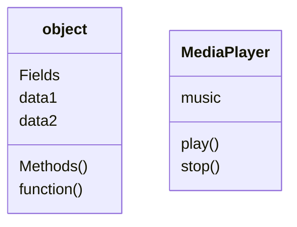

html 태그에는

Box 기능을 하는 tag들과 item 기능을 하는 tag들로 나누어짐 


### box

article : 조금 더 재사용이 가능한 것들을 모아놓음. 

div : 묶어서 스타일링할 때 

span은 inline 태그

Div block level

```css
@media screen and (min-width:800px){
	.container{
		width: 50%; 
	}
}
```


#### 절차지향 프로그래밍

하나의 어플리케이션을 만든다면, 함수를 위주로 개발하는 것. `정의된 순서대로 함수 호출`

하나를 수정하기 위해 전체적인 어플리케이션의 동작을 이해해야하고, 

side effect가 발생할 가능성도 높다는 단점. 

유지보수, 확장이 어렵다. 


### 객체지향 프로그래밍 

객체들끼리 의사소통할 수 있도록 디자인

서로 관련있는 `데이터`나 `함수`를 `object`로 정의해서 프로그래밍한다. 

관련있는 object를 재사용하거나, 수정해주면 됨. 

새로 object만 추가하면 되니까 확장성도 좋고, 생산성도 좋다.  

object는 명사로 이름 지정 




class는 template

class로 데이터를 넣어 만든것이 object. class의 인스턴스다. 

class는 student라면 object는 학생1, 학생2 


## 객체지향의 원칙 

### 캡슐화 

서로 관련있는 함수를 한 object내에 담아두고, 외부에서 보이지 않게 데이터를 숨긴다. 

Ex) 고양이의 상태를 외부에서 강제로 변경할 수 없음. 함수를 통해서 상태 변경함. 

### 추상화 

내부의 복잡한 구조를 이해하지 않고도, 사용할 수 있다.

지정된 외부의 함수를 이용해서 object를 이용할 수 있다.  

### 상속

parenct classs, child classs

super class, sub class

 ```mermaid
 classDiagram
       Animal <|-- Duck
       Animal <|-- Fish
       Animal <|-- Zebra
       Animal: makeSound()
       class Duck{
           makeSound()
       }
       class Fish{
         makeSound()
       }
       class Zebra{
       makeSound()
       }
 ```


### 다형성 

상속을 통해 만들어진 객체들도 공통된 함수를 통해 접근할 수 있음. 


